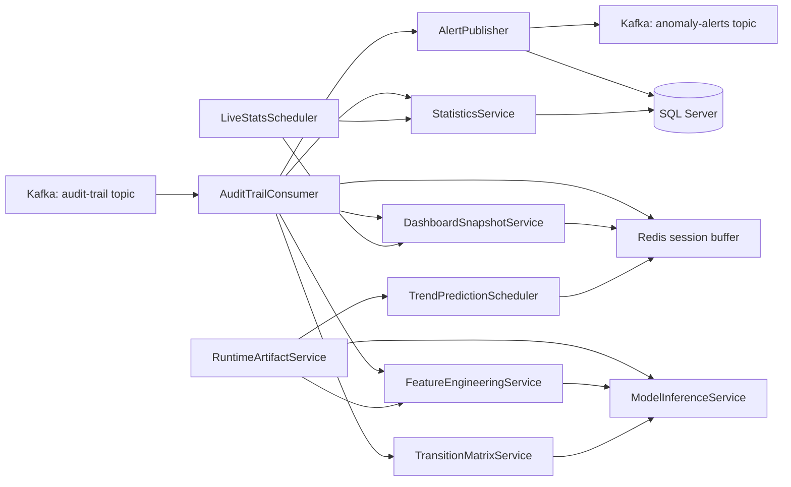

# Data Processor

An event-driven backend worker for audit-trail analysis, anomaly detection, live statistics, and behavior forecasting.

This project consumes audit events from Kafka, rebuilds user sessions in Redis, applies rule-based and ML-based scoring, persists analytical results to SQL Server, and publishes anomaly alerts back to Kafka. It also computes rolling risk profiles, surfaces session-level insights for dashboards, and refreshes precomputed volume forecasts.

## Why This Project Exists

Modern digital platforms generate large volumes of user activity logs. Raw logs are useful, but they are hard to act on directly. This repository turns those logs into operational intelligence:

- Detect suspicious or abnormal user behavior in near real time
- Classify anomaly types once a session looks abnormal
- Estimate churn propensity and assign a lightweight persona cluster
- Predict likely next actions from learned action-to-action frequencies
- Track live platform activity and error rates
- Serve dashboard-ready snapshots (live stats, forecasts, CSV-backed exports)
- Persist everything in a form that can be queried, monitored, and audited

## What It Does

At runtime, the application acts as a background processing service, not a web API.

Core capabilities:

- Kafka ingestion of audit-trail events
- Session reconstruction using Redis lists
- Tier 1 anomaly detection with deterministic business rules
- Additional heuristic detection for rapid-fire bursts, geo jumps, session timeouts, rare Markov transitions, and path deviation on the latest transition
- Tier 2 scoring with ONNX models over tabular session summaries (binary anomaly detector, churn classifier, persona clustering)
- Tier 3 enrichment: random-forest anomaly typing, Markov-based next-action ranking, path deviation context, ensemble risk score
- SQL persistence of session analytics, anomaly events, trend snapshots, and user risk profiles
- Redis caching of live session state, per-session insights, next-action hints, and aggregated dashboard payloads
- Scheduled live-stat refresh and forecast snapshot jobs

## High-Level Architecture



## End-to-End Processing Flow

1. An audit event is consumed from Kafka.
2. The event is parsed into `AuditTrailEvent`.
3. The event is appended to a Redis session buffer keyed by `insuredId` and `sessionId`.
4. Live counters are updated in Redis for dashboards and operational metrics.
5. The rolling session is enriched (KO streaks, login flags, download bursts, timing features, and related aggregates).
6. A `SessionSummary` is built from the enriched timeline.
7. Tier 1 rules run on the current session (unusual hour, skip login, repeated fail, rapid fire, geo jump, session timeout, impossible transitions, path deviation on the last step).
8. `ModelInferenceService` produces a `SessionInsight`: ONNX tabular scores, optional type classification, churn and cluster outputs, Markov next actions, and path deviation metadata.
9. The insight is cached for dashboards; next-action hints are cached per insured user.
10. When alerting criteria are met and the session has not already emitted an alert, an anomaly alert is published.
11. When the session ends (configured logout actions):
    - session analysis is persisted with the full feature snapshot
    - next-action history is stored
    - user risk profile is refreshed
    - dashboard aggregates are refreshed from SQL and bundled artifacts
    - ephemeral per-session Redis keys are cleared

## Detection Strategy

### Tier 1: Rule-Based Detection

Fast deterministic rules catch obvious behavior without invoking ML:

- Activity during suspicious UTC hours
- Session starts without an allowed login action
- Repeated consecutive `KO` events in configured action types
- Very dense bursts of activity within a tiny time window
- Country changes within one session
- Large inactivity gaps inside the same logical session
- Action transitions whose Markov probability is below the impossible-sequence threshold
- Latest transition flagged as path deviation when its probability is below the path-deviation threshold

### Tier 2: ONNX Tabular Scoring

Session-level aggregates are turned into fixed-length feature vectors and scored with ONNX Runtime:

- **Binary detector** (for example isolation forest or gradient-boosted export, as declared in the manifest) for a primary anomaly signal
- **Churn model** for abandonment-style risk
- **Clustering pipeline** for persona / behavioral segment id

Feature column lists and numeric imputation medians are loaded from JSON referenced by `deployment_manifest.json`.

### Tier 3: Session Enrichment

When the combined signal indicates an abnormal session, the worker can:

- classify anomaly type with a random-forest ONNX model
- rank next actions using the Markov transition table
- record path deviation (low-probability last transition)
- derive an ensemble risk score from model outputs and session context
- publish alerts and persist rich `SessionAnalysis` rows

## Tech Stack

| Area | Technology |
| --- | --- |
| Language | Java 25 |
| Framework | Spring Boot 4 |
| Messaging | Apache Kafka |
| Cache / session state | Redis |
| Persistence | Spring Data JPA + SQL Server |
| Migrations | Liquibase + SQL changelog |
| ML inference | ONNX Runtime |
| Volume trends | Precomputed forecast series (CSV + JSON metadata), cached by the scheduler |
| Serialization | Jackson |
| Boilerplate reduction | Lombok |
| Logging | Logback + Logstash encoder |
| Build | Maven Wrapper |
| Testing | JUnit 5, Spring Test, Instancio, Testcontainers |

## Project Structure

```text
Data Processor/
|-- src/
|   |-- main/
|   |   |-- java/com/noveocare/dataprocessor/
|   |   |   |-- ai/           # Feature engineering, manifest-driven artifact loading
|   |   |   |-- config/       # Typed configuration bindings and shared config beans
|   |   |   |-- dto/          # Kafka payloads, session insight, and transport objects
|   |   |   |-- entity/       # JPA entities persisted to SQL Server
|   |   |   |-- inference/    # ONNX inference and Markov transition helpers
|   |   |   |-- kafka/        # Kafka consumer and alert publisher
|   |   |   |-- redis/        # Redis helpers and session buffer service
|   |   |   |-- repository/   # Spring Data repositories
|   |   |   |-- service/      # Statistics, schedulers, dashboard snapshots
|   |   |   `-- DataProcessorApplication.java
|   |   `-- resources/
|   |       |-- AI/           # deployment_manifest.json, feature_bundle.json, models, Markov data, forecasts, exports
|   |       |-- db/changelog/ # Liquibase changelog entrypoint
|   |       |-- db/migration/ # Database bootstrap SQL
|   |       |-- application.yaml
|   |       `-- logback-spring.xml
|   `-- test/
|       `-- java/...          # Feature-engineering and runtime artifact tests
|-- docker/                   # Optional infrastructure compose files (for example Vault)
|-- .mvn/
|-- mvnw
|-- mvnw.cmd
|-- pom.xml
|-- HELP.md
`-- README.md
```

Offline notebooks and Python simulators may also live under `src/main/resources/AI/` or in the parent repository’s `scripts/` directory, depending on how you organize training.

## Key Packages

### `kafka`

- `AuditTrailConsumer`: the main processing pipeline
- `AlertPublisher`: persists, caches, and emits anomaly alerts

### `ai`

- `FeatureEngineeringService`: enriches events and builds `SessionSummary` tabular features
- `RuntimeArtifactService`: loads `deployment_manifest.json`, `feature_bundle.json`, Markov lookup, forecast series, and dashboard CSV exports
- `DeploymentManifest` / `FeatureBundle`: typed views of the manifest and bundle

### `inference`

- `ModelInferenceService`: loads ONNX sessions from the manifest and orchestrates scoring and enrichment
- `VelocityDetector`: flags rapid-fire activity and long intra-session gaps
- `GeoJumpDetector`: flags sessions whose country changes mid-flow
- `TransitionMatrixService`: Markov transition probabilities, next-action ranking, path deviation, and impossible-sequence checks

### `service`

- `StatisticsService`: computes session metrics, live stats, and user risk profiles
- `LiveStatsScheduler`: periodically refreshes dashboard snapshots
- `TrendPredictionScheduler`: pushes precomputed forecast series into Redis for dashboards
- `DashboardSnapshotService`: caches session insights and refreshes dashboard aggregates (including manifest-listed CSV exports)

### `entity` and `repository`

These packages define and access the persistent analytical model, including `session_analysis`, `anomaly_events`, action statistics, next-action predictions, and user risk profiles (see Liquibase changelogs for the authoritative schema).

## AI Assets and the Deployment Manifest

Runtime ML behavior is driven by `src/main/resources/AI/deployment_manifest.json`, which points to:

- ONNX artifacts for binary detection, anomaly typing, churn, and clustering (exact filenames are whatever you ship alongside the manifest)
- JSON feature column lists and numeric medians for each model
- `markov_transition_lookup.json` for next-action and transition-probability rules
- Forecast CSVs plus companion JSON for dashboard trend cards
- Optional dashboard CSV exports (alerts feed, cluster mix, drop-off actions, and similar) ingested at startup for Redis snapshots

`feature_bundle.json` groups shared feature metadata used while engineering session vectors.

Large binary model files might be omitted from Git in some setups; when they are absent, place the ONNX files next to the manifest on the classpath or adjust `app.ai.base-path` to a file location your deployment mounts.

## Scripts and Offline Training

Training and simulation are intentionally decoupled from the Spring Boot runtime. The `SimData_v3_final.ipynb` notebook under `src/main/resources/AI/` documents one end-to-end workflow for regenerating ONNX models, the manifest, Markov tables, and forecast artifacts. Additional Python utilities may live in the parent monorepo under `scripts/` (for example dataset simulators).

## Configuration

Main configuration lives in `src/main/resources/application.yaml`.

Important sections:

- `spring.datasource`: SQL Server connection
- `spring.liquibase`: database changelog bootstrap
- `spring.kafka`: Kafka producer and consumer settings
- `spring.data.redis`: Redis connection
- `app.kafka.topics`: input and output topics
- `app.redis.ttl`: Redis retention windows (session buffer, next actions, risk, live stats, dashboard, forecast, session insight, and others)
- `app.rules`: rule-based anomaly logic, including `impossible-seq`, `path-deviation`, and `session-end-actions`
- `app.risk`: thresholds for user risk tiers
- `app.stats.live`: dashboard aggregation windows
- `app.scheduling`: scheduler cadence (`live-stats-fixed-rate-ms`, `trend-cron`)
- `app.trend`: spike detection sensitivity where applicable
- `app.ai`: `base-path`, `manifest`, and `feature-bundle` resource names
- `app.features`: feature-engineering tuning (for example download window, rapid action window, session alert risk threshold)

## Local Development

### Prerequisites

- Java 25
- Maven Wrapper support
- SQL Server running locally
- Kafka reachable at `localhost:9092`
- Redis reachable at `localhost:6379`
- Docker containers for Kafka and Redis are fine as long as those ports are published to the host

### Default Local Assumptions

The current configuration expects:

- Kafka at `localhost:9092`
- Redis at `localhost:6379`
- SQL Server at `localhost:1433`

If your Kafka and Redis instances already run in Docker and expose those ports, no extra setup is needed for them. If your environment differs, update `application.yaml` or externalize configuration before starting the app.

### Environment Variables (Recommended for GitHub)

Use environment variables (or a local `.env` loaded by your shell/IDE) instead of committing credentials and host URLs.

You can start from `.env.example` and set at least:

- `DB_URL`
- `DB_USERNAME`
- `DB_PASSWORD`
- `KAFKA_BOOTSTRAP_SERVERS`
- `KAFKA_CONSUMER_GROUP_ID`
- `AUDIT_TRAIL_TOPIC`
- `ANOMALY_ALERTS_TOPIC`
- `REDIS_HOST`
- `REDIS_PORT`

The repository ignores `.env` files by default (`.gitignore`) and keeps only `.env.example` tracked.

### Typical Local Setup

A practical local setup for this repository is:

- Kafka running in Docker and exposed on `localhost:9092`
- Redis running in Docker and exposed on `localhost:6379`
- SQL Server running locally or in a separate container exposed on `localhost:1433`
- The processor started from the host with Java and Maven Wrapper

### Build

```powershell
.\mvnw.cmd compile
```

### Run Tests

Unit tests:

```powershell
.\mvnw.cmd test
```

Integration tests (`*IT`) with Testcontainers:

```powershell
.\mvnw.cmd verify
```

### Start the Processor

```powershell
.\mvnw.cmd spring-boot:run
```

### Build Docker Image (Jib)

```powershell
.\mvnw.cmd jib:dockerBuild
```

### Optional Vault Container

```powershell
docker compose -f docker/docker-compose.vault.yaml up -d
```

This starts a local dev Vault instance. Application-side secret loading from Vault is intentionally left optional and can be wired when you decide on the final secret-management flow.

## Example Runtime Outputs

During execution, the system produces and maintains:

- Redis session buffers per active user session
- Redis live-stat snapshots for dashboards
- Redis session insight and next-action caches
- Redis dashboard payloads (including forecast snapshots and exported CSV summaries when configured)
- SQL session analysis records
- SQL anomaly event history
- SQL next-action predictions
- SQL user risk profiles
- SQL daily action statistics
- Kafka anomaly-alert messages

## Testing Status

The repository includes tests around feature engineering and manifest-driven artifact loading, which are the highest-risk contracts for the ML path.

Verified commands:

```powershell
.\mvnw.cmd -q -DskipTests compile
.\mvnw.cmd -q test
.\mvnw.cmd -q verify
```

## Notes for Contributors

- This project is a worker service, not a REST API.
- ONNX inputs depend on the exact feature order defined in the JSON column lists referenced by the manifest.
- Redis holds operational state and low-latency dashboard materializations; SQL Server is the durable analytics store.
- When you change models, vocabularies, or Markov tables, regenerate `deployment_manifest.json`, the ONNX files, and any dependent JSON, then validate with tests and a local dry run.
- Impossible-sequence and path-deviation logic both read transition probabilities from the Markov lookup; keep `app.rules.impossible-seq.min-probability` and `app.rules.path-deviation.min-probability` aligned with the data you trained on.

## Suggested Next Improvements

- Add integration tests for Kafka → Redis → DB → alert flow
- Externalize credentials and local endpoints through environment variables
- Add Docker Compose for Kafka, Redis, and SQL Server
- Add sample Kafka payloads and a quick demo walkthrough
- Add architecture diagrams for the training pipeline in addition to the runtime pipeline
- Replace placeholder POM metadata (`groupId`, description, SCM fields) with project-specific values

## Repository At A Glance

If you are opening this repository for the first time, start here:

1. Read `src/main/resources/application.yaml` to understand the runtime environment.
2. Read `src/main/resources/AI/deployment_manifest.json` to see which artifacts the worker expects.
3. Read `kafka/AuditTrailConsumer.java` to understand the main processing pipeline.
4. Read `ai/FeatureEngineeringService.java` and `inference/ModelInferenceService.java` to understand features and ONNX scoring.
5. Read `service/DashboardSnapshotService.java`, `service/StatisticsService.java`, and `service/TrendPredictionScheduler.java` to understand analytics and forecasting snapshots.

---

Built as a Spring Boot data-processing pipeline for session analytics, anomaly intelligence, and behavior forecasting.
