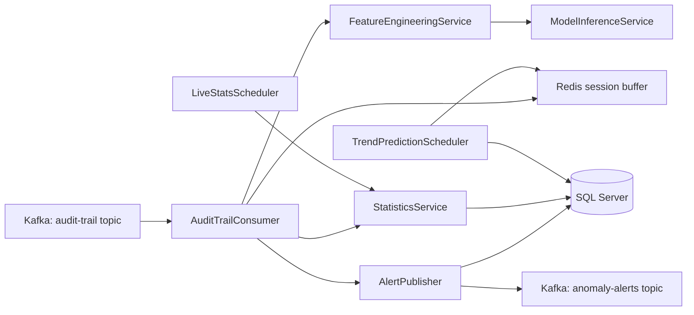

# Data Processor

An event-driven backend worker for audit-trail analysis, anomaly detection, live statistics, and behavior forecasting.

This project consumes audit events from Kafka, rebuilds user sessions in Redis, applies rule-based and ML-based anomaly detection, persists analytical results to SQL Server, and publishes anomaly alerts back to Kafka. It also computes rolling risk profiles and predicts next-day action trends.

## Why This Project Exists

Modern digital platforms generate large volumes of user activity logs. Raw logs are useful, but they are hard to act on directly. This repository turns those logs into operational intelligence:

- Detect suspicious or abnormal user behavior in near real time
- Classify anomaly types once a suspicious session is confirmed
- Predict likely next actions inside a user journey
- Track live platform activity and error rates
- Forecast daily action volumes and flag spikes
- Persist everything in a form that can be queried, monitored, and audited

## What It Does

At runtime, the application acts as a background processing service, not a web API.

Core capabilities:

- Kafka ingestion of audit-trail events
- Session reconstruction using Redis lists
- Tier 1 anomaly detection with deterministic business rules
- Additional heuristic detection for rapid-fire bursts, geo jumps, session timeouts, and impossible transitions
- Tier 2 anomaly detection with an ONNX autoencoder
- Tier 3 anomaly enrichment with anomaly-type classification and next-action prediction
- SQL persistence of session analytics, anomaly events, trend stats, and user risk profiles
- Redis caching of live session state and dashboard snapshots
- Scheduled live-stat refresh and trend prediction jobs

## High-Level Architecture



## End-to-End Processing Flow

1. An audit event is consumed from Kafka.
2. The event is parsed into `AuditTrailEvent`.
3. The event is appended to a Redis session buffer keyed by `insuredId` and `sessionId`.
4. Live counters are updated in Redis for dashboards and operational metrics.
5. Tier 1 rules run immediately:
   - unusual hour
   - skip login
   - repeated fail
   - rapid fire
   - geo jump
   - session timeout
   - impossible sequence
6. Every `N` events, the current session is transformed into a feature matrix and scored by the autoencoder.
7. Mid-session next-action predictions can be cached for dashboards even before the session closes.
8. When the session ends:
   - final session statistics are computed
   - final autoencoder score is stored
   - next actions are predicted
   - anomaly type is classified if needed
   - session analysis is persisted
   - anomaly alerts are published if the session is suspicious
   - user risk profile is refreshed

## Detection Strategy

### Tier 1: Rule-Based Detection

Fast deterministic rules catch obvious behavior without invoking ML:

- Activity during suspicious UTC hours
- Session starts without an allowed login action
- Repeated consecutive `KO` events in configured action types
- Very dense bursts of activity within a tiny time window
- Country changes within one session
- Large inactivity gaps inside the same logical session
- Action transitions whose learned probability is below a configured threshold

### Tier 2: Autoencoder Scoring

The project uses an ONNX autoencoder to score how abnormal a session sequence looks compared with trained behavior.

Inputs include:

- action ids
- device ids
- country ids
- type and subtype ids
- previous action
- cyclic hour/day features
- inter-event time deltas
- sequence position
- session length
- KO counts
- IP change flags

### Tier 3: Session Enrichment

When a session is considered suspicious, the system can:

- classify the anomaly type
- predict the top next actions
- persist a consolidated session analysis
- publish a final anomaly alert with richer context

## Tech Stack

| Area | Technology |
| --- | --- |
| Language | Java 25 |
| Framework | Spring Boot 4 |
| Messaging | Apache Kafka |
| Cache / session state | Redis |
| Persistence | Spring Data JPA + SQL Server |
| Migrations | Liquibase + SQL changelog |
| Sequence inference | ONNX Runtime |
| Trend prediction | XGBoost4J |
| Serialization | Jackson |
| Boilerplate reduction | Lombok |
| Logging | Logback + Logstash encoder |
| Build | Maven Wrapper |
| Testing | JUnit 5, Spring Test, Instancio, Testcontainers |

## Project Structure

```text
Data Processor/
|-- src/
|   |-- main/
|   |   |-- java/com/noveocare/dataprocessor/
|   |   |   |-- ai/           # Feature engineering, vocab loading, thresholds, label maps
|   |   |   |-- config/       # Typed configuration bindings and shared config beans
|   |   |   |-- dto/          # Kafka payloads and internal transport objects
|   |   |   |-- entity/       # JPA entities persisted to SQL Server
|   |   |   |-- inference/    # ONNX inference service
|   |   |   |-- kafka/        # Kafka consumer and alert publisher
|   |   |   |-- redis/        # Redis helpers and session buffer service
|   |   |   |-- repository/   # Spring Data repositories
|   |   |   |-- service/      # Statistics and scheduled jobs
|   |   |   `-- DataProcessorApplication.java
|   |   `-- resources/
|   |       |-- AI/           # Models, vocab files, label maps, notebooks, generators
|   |       |-- db/changelog/ # Liquibase changelog entrypoint
|   |       |-- db/migration/ # Database bootstrap SQL
|   |       |-- application.yaml
|   |       `-- logback-spring.xml
|   `-- test/
|       `-- java/...          # Feature-engineering tests
|-- docker/                   # Optional infrastructure compose files (for example Vault)
|-- scripts/                  # Offline training and metadata-generation helpers
|-- .mvn/
|-- mvnw
|-- mvnw.cmd
|-- pom.xml
|-- HELP.md
`-- README.md
```

## Key Packages

### `kafka`

- `AuditTrailConsumer`: the main processing pipeline
- `AlertPublisher`: persists, caches, and emits anomaly alerts

### `ai`

- `FeatureEngineeringService`: builds the sequence-model feature matrix
- `VocabService`: maps labels to ids used during inference
- `FeatureConfigLoader`, `DeltaScalerLoader`, `AnomalyThresholdLoader`: load model metadata
- `LabelMapService`: converts classifier outputs into readable labels

### `inference`

- `ModelInferenceService`: runs ONNX models for anomaly scoring, anomaly typing, and next-action prediction
- `VelocityDetector`: flags rapid-fire activity and long intra-session gaps
- `GeoJumpDetector`: flags sessions whose country changes mid-flow
- `TransitionMatrixService`: flags unlikely action transitions using a learned transition matrix

### `service`

- `StatisticsService`: computes session metrics, live stats, and user risk profiles
- `LiveStatsScheduler`: periodically refreshes dashboard snapshots
- `TrendPredictionScheduler`: predicts daily action trends and spike alerts

### `entity` and `repository`

These packages define and access the persistent analytical model:

- `session_analysis`
- `anomaly_events`
- `action_stats_daily`
- `next_action_predictions`
- `user_risk_profile`

## AI Assets Included in the Repository

The `src/main/resources/AI/` folder contains the runtime assets used by the system:

- ONNX models for anomaly detection, anomaly-type classification, and next-action prediction
- JSON vocabularies and label maps
- feature configuration files
- threshold and scaler metadata
- XGBoost trend model artifacts
- data-generation and simulation scripts
- notebook artifacts used during experimentation

This makes the repository useful both as an application and as a reproducible ML-backed prototype.

## Scripts

The `scripts/` folder contains offline utilities that support the runtime heuristics and experimentation workflow:

- `generate_transition_matrix.py`: builds `transition_matrix.json` from sessionized audit data
- `train_session_scorer.py`: trains a simple session-level XGBoost anomaly scorer and exports its feature list

These scripts are not part of the Spring Boot runtime, but they help produce model-adjacent assets consumed by the application.

## Configuration

Main configuration lives in `src/main/resources/application.yaml`.

Important sections:

- `spring.datasource`: SQL Server connection
- `spring.liquibase`: database changelog bootstrap
- `spring.kafka`: Kafka producer and consumer settings
- `spring.data.redis`: Redis connection
- `app.kafka.topics`: input and output topics
- `app.redis.ttl`: Redis retention windows
- `app.rules`: rule-based anomaly logic
- `app.risk`: thresholds for user risk tiers
- `app.stats.live`: dashboard aggregation windows
- `app.scheduling`: scheduler cadence
- `app.trend`: spike detection sensitivity
- `app.ai`: model and metadata resource paths
- `app.features`: feature-engineering options

## Local Development

### Prerequisites

- Java 25
- Maven Wrapper support
- SQL Server running locally
- Kafka reachable at `localhost:9092`
- Redis reachable at `localhost:6379`
- Docker containers for Kafka and Redis are fine as long as those ports are published to the host

### Default Local Assumptions

The current configuration expects:

- Kafka at `localhost:9092`
- Redis at `localhost:6379`
- SQL Server at `localhost:1433`

If your Kafka and Redis instances already run in Docker and expose those ports, no extra setup is needed for them. If your environment differs, update `application.yaml` or externalize configuration before starting the app.

### Environment Variables (Recommended for GitHub)

Use environment variables (or a local `.env` loaded by your shell/IDE) instead of committing credentials and host URLs.

You can start from `.env.example` and set at least:

- `DB_URL`
- `DB_USERNAME`
- `DB_PASSWORD`
- `KAFKA_BOOTSTRAP_SERVERS`
- `KAFKA_CONSUMER_GROUP_ID`
- `AUDIT_TRAIL_TOPIC`
- `ANOMALY_ALERTS_TOPIC`
- `REDIS_HOST`
- `REDIS_PORT`

The repository ignores `.env` files by default (`.gitignore`) and keeps only `.env.example` tracked.

### Typical Local Setup

A practical local setup for this repository is:

- Kafka running in Docker and exposed on `localhost:9092`
- Redis running in Docker and exposed on `localhost:6379`
- SQL Server running locally or in a separate container exposed on `localhost:1433`
- The processor started from the host with Java and Maven Wrapper

### Build

```powershell
.\mvnw.cmd compile
```

### Run Tests

Unit tests:

```powershell
.\mvnw.cmd test
```

Integration tests (`*IT`) with Testcontainers:

```powershell
.\mvnw.cmd verify
```

### Start the Processor

```powershell
.\mvnw.cmd spring-boot:run
```

### Build Docker Image (Jib)

```powershell
.\mvnw.cmd jib:dockerBuild
```

### Optional Vault Container

```powershell
docker compose -f docker/docker-compose.vault.yaml up -d
```

This starts a local dev Vault instance. Application-side secret loading from Vault is intentionally left optional and can be wired when you decide on the final secret-management flow.

## Example Runtime Outputs

During execution, the system produces and maintains:

- Redis session buffers per active user session
- Redis live-stat snapshots for dashboards
- Redis anomaly and risk caches
- SQL session analysis records
- SQL anomaly event history
- SQL next-action predictions
- SQL user risk profiles
- SQL daily action statistics and trend forecasts
- Kafka anomaly-alert messages

## Testing Status

The repository currently includes focused tests around feature engineering, which is the most critical contract for the ML pipeline.

Verified commands:

```powershell
.\mvnw.cmd -q -DskipTests compile
.\mvnw.cmd -q test
.\mvnw.cmd -q verify
```

## Notes for Contributors

- This project is a worker service, not a REST API.
- The ML models depend on the exact feature order defined in the JSON configuration files.
- Redis is used both for short-lived operational state and fast dashboard access.
- SQL Server stores the durable analytics layer.
- If you change vocabularies, feature columns, or model files, update both runtime resources and any related training artifacts.
- If you enable impossible-sequence detection, make sure `transition_matrix.json` is generated and available under the AI resources path.

## Suggested Next Improvements

- Add integration tests for Kafka -> Redis -> DB -> alert flow
- Externalize credentials and local endpoints through environment variables
- Add Docker Compose for Kafka, Redis, and SQL Server
- Add sample Kafka payloads and a quick demo walkthrough
- Add architecture diagrams for the training pipeline in addition to the runtime pipeline
- Replace placeholder POM metadata (`groupId`, description, SCM fields) with project-specific values

## Repository At A Glance

If you are opening this repository for the first time, start here:

1. Read `src/main/resources/application.yaml` to understand the runtime environment.
2. Read `kafka/AuditTrailConsumer.java` to understand the main processing pipeline.
3. Read `ai/FeatureEngineeringService.java` and `inference/ModelInferenceService.java` to understand the ML path.
4. Read `service/StatisticsService.java` and `service/TrendPredictionScheduler.java` to understand analytics and forecasting.
5. Explore `src/main/resources/AI/` and `scripts/` to see the model assets and data-generation tooling.

---

Built as a Spring Boot data-processing pipeline for session analytics, anomaly intelligence, and behavior forecasting.
