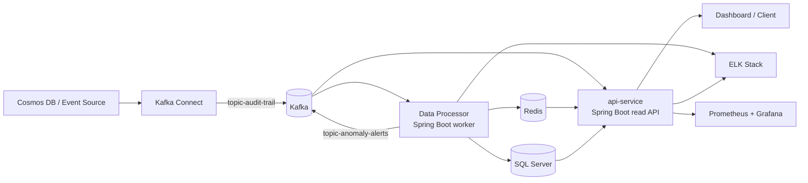

# PFE — NoveoCare Analytics Platform

An event-driven, ML-powered analytics platform that ingests insured-user audit trails from a production system (Cosmos DB), reconstructs behavioral sessions in real time, applies a multi-tier anomaly detection ensemble, and exposes operational intelligence through a read-only dashboard API.

---

## Table of Contents

1. [Project Context](#project-context)
2. [Architecture Overview](#architecture-overview)
3. [Core Runtime Flow](#core-runtime-flow)
4. [Component Deep Dive](#component-deep-dive)
   - [Data Processor](#1-data-processor--ml-inference-engine)
   - [API Service](#2-api-service--dashboard-backend)
   - [Infrastructure](#3-infrastructure)
   - [Monitoring](#4-monitoring)
   - [ELK Stack](#5-elk-stack)
   - [DevOps](#6-devops--pfe-devops)
   - [Scripts & Simulation](#7-scripts--simulation)
   - [Datasets](#8-datasets--data)
5. [ML Models & Analytics Strategy](#ml-models--analytics-strategy)
6. [Data Stores & Responsibilities](#data-stores--responsibilities)
7. [Redis Key Layout](#redis-key-layout)
8. [Database Schema (SQL Server)](#database-schema-sql-server)
9. [Configuration Reference](#configuration-reference)
10. [Environment Variables](#environment-variables)
11. [Local Development](#local-development)
12. [CI/CD Pipeline](#cicd-pipeline)
13. [Docker Build](#docker-build)
14. [Security Notes](#security-notes)
15. [Known Limitations](#known-limitations)
16. [Repository Map](#repository-map)

---

## Project Context

This repository is the full backend for **NoveoCare**, an operational intelligence platform for monitoring insured-user behavior in a telecom/OTT digital portal context. It is not a single application but a small platform comprising:

- A **background analytics worker** (Data Processor) that consumes audit events and produces ML-driven session analyses
- A **read-only REST API** (api-service) that serves those analytics to a Vue.js/Quasar frontend dashboard
- **Infrastructure definitions** for Kafka, Redis, Kafka Connect, and supporting services
- **Observability stacks** for metrics (Prometheus + Grafana) and logging (ELK)
- **DevOps tooling** for self-hosted CI/CD (GitLab + Runner)
- **Simulation & experimentation assets** — synthetic data generators, Jupyter notebooks, trained ML models

The core use case: detect abnormal sessions, classify attack types, estimate user risk, predict next actions, and expose live stats and anomaly streams to a frontend.

---

## Architecture Overview



**Technology stack:**

| Layer | Technology |
|-------|-----------|
| Runtime | Java 25, Spring Boot 4.0.3 |
| Event bus | Apache Kafka 7.7.7 (KRaft mode, no Zookeeper) |
| Cache / live state | Redis 8.2 |
| Durable storage | SQL Server |
| ML inference | ONNX Runtime (XGBoost, Random Forest, Isolation Forest, K-Means) |
| Time-series forecasting | Prophet (pre-computed CSV forecasts) |
| Markov chain | Custom transition matrix (JSON) |
| AI explanations | Google Gemini 2.5 Flash (optional) |
| Metrics | Prometheus + Grafana |
| Logging | Elasticsearch + Logstash + Kibana |
| Containerization | Docker Compose + Jib (Maven plugin, no Dockerfiles) |
| CI/CD | GitLab CE + GitLab Runner |
| Data simulation | Python 3 + Jupyter Notebook |

---

## Core Runtime Flow

1. **Event ingestion:** Audit-trail events arrive from Azure Cosmos DB. Kafka Connect (with the Cosmos DB source connector) streams them into the `topic-audit-trail` Kafka topic.

2. **Session reconstruction:** `Data Processor` consumes the audit stream, buffers per-session events in Redis, and rebuilds full user sessions with feature engineering (time deltas, IP/device change detection, KO streaks, download bursts, ping-pong loops).

3. **Heuristic rules (Tier 1):** Fast deterministic checks run on every session — suspicious hours, missing login, repeated failures, rapid-fire bursts, geo jumps, inactivity timeouts, impossible Markov transitions.

4. **ML inference (Tier 2):** An ONNX ensemble scores each session:
   - XGBoost binary anomaly detector (primary)
   - Isolation Forest unsupervised outlier detector (fallback)
   - Random Forest anomaly type classifier (11 classes)
   - Random Forest churn/dropoff predictor
   - K-Means persona clustering (8 clusters)

5. **Markov chain analysis (Tier 3):** Path deviation detection (improbable transitions) and next-action prediction (top-3 most likely subsequent actions).

6. **Ensemble risk scoring:** Weighted composite score (0-100) combining IP change, device change, KO count, download bursts, ping-pong loops, anomaly probability, and churn probability.

7. **Persistence & publishing:**
   - Writes `SessionAnalysis`, `AnomalyEvent`, `NextActionPrediction`, `UserRiskProfile` to SQL Server
   - Caches session insights, risk profiles, next actions, active anomalies in Redis
   - Publishes anomaly alerts to `topic-anomaly-alerts` Kafka topic
   - Publishes refresh notifications to Redis PubSub (`LIVE_STATS` channel)

8. **Dashboard serving:** `api-service` reads from Redis (live stats, forecasts, active anomalies, insights) and SQL Server (historical sessions, anomaly events, risk profiles) to serve REST endpoints and SSE streams to the Quasar frontend.

9. **Observability:** Prometheus scrapes Spring Boot Actuator metrics; Logstash ingests structured logs via TCP; Kibana provides search and visualization.

---

## Component Deep Dive

### 1. Data Processor — ML Inference Engine

**Location:** `Data Processor/`

**Role:** Background worker (non-web, `spring.main.web-application-type: none`). The heart of the analytics pipeline.

**Key classes:**

| Class | Lines | Purpose |
|-------|-------|---------|
| `AuditTrailConsumer.java` | 468 | Kafka consumer — deserializes events, buffers in Redis, orchestrates the full inference pipeline per session |
| `FeatureEngineeringService.java` | 489 | Per-event enrichment (time deltas, change flags, KO streaks, download windows, ping-pong detection) + session-level aggregation |
| `ModelInferenceService.java` | 687 | ONNX Runtime inference orchestrator — runs all 5 models sequentially per session |
| `TransitionMatrixService.java` | 115 | Markov chain — path deviation detection + next-action prediction |
| `RuntimeArtifactService.java` | 483 | Loads all AI artifacts (ONNX models, JSON configs, CSVs) at startup |
| `StatisticsService.java` | 433 | Real-time stats tracking + user risk profile updates |
| `DashboardSnapshotService.java` | 593 | Dashboard snapshot management + forecast alignment |
| `TrendPredictionScheduler.java` | 121 | Prophet forecast refresh + system traffic anomaly evaluation |
| `CacheKeys.java` | 102 | Redis key layout (shared with API service) |

**Processing pipeline per session:**

```
Kafka event → Redis buffer → feature engineering → rule evaluation
  → XGBoost/IF anomaly detection → Markov path deviation
  → RF anomaly type classification → RF churn prediction
  → K-Means clustering → Markov next-action prediction
  → ensemble risk score → feature contributions → explainability text
  → SQL Server write + Redis cache + Kafka alert
```

**Load shedding:** When Kafka consumer lag exceeds 10,000, `inferLightweight()` skips all ML models and uses pure heuristics.

**Scheduled jobs:**

| Job | Frequency | Description |
|-----|-----------|-------------|
| `LiveStatsScheduler` | Every 5s | Refreshes live stats snapshot in Redis |
| `TrendPredictionScheduler` | Every 30s | Refreshes forecast dashboard + evaluates system traffic anomaly via Prophet rate-based projection |

**ML Models (all served via ONNX Runtime):**

| Model | Algorithm | Input Features | Output |
|-------|-----------|----------------|--------|
| `xgb_binary.onnx` | XGBoost (supervised binary) | 75 | Anomaly probability (threshold ≥ 0.5) |
| `iso_binary.onnx` | Isolation Forest (unsupervised) | 75 | Label + score (fallback) |
| `rf_type.onnx` | Random Forest (11-class) | 75 | Anomaly type + confidence |
| `rf_churn.onnx` | Random Forest (binary) | 56 | Churn probability |
| `kmeans_persona_pipeline.onnx` | StandardScaler + K-Means | 10 | Cluster label (0-7) |

**Heuristic rules (pre-ML fast path):**
- `unusual_hour`: Activity between 02:00-04:00 UTC
- `skip_login`: Session actions without prior login
- `repeated_fail`: 3+ consecutive KO errors (BANKING_ACTIONS, LOGGING_ACTIONS)
- `rapid_fire`: 3+ events within 2-second window
- `geo_jump`: Country code change between consecutive events
- `session_timeout`: Inter-event gap > 20 minutes
- `impossible_seq`: Markov transition probability < 0.005
- `path_deviation`: Last transition probability < 0.02

**11 Anomaly Types:** `data_exfiltration`, `distributed_brute_force`, `geo_jump`, `impossible_device_switch`, `impossible_seq`, `ping_pong_loop`, `rapid_fire`, `repeated_fail`, `skip_login`, `unusual_hour`, `zombie_session`

**Default port:** N/A (non-web)

---

### 2. API Service — Dashboard Backend

**Location:** `api-service/`

**Role:** Read-only REST API that serves real-time analytics, session data, anomaly events, risk profiles, and AI-powered explanations to a Quasar (Vue 3) frontend.

**Key characteristics:**
- Stateless, read-only (schema migrations owned by Data Processor)
- Redis-first read strategy (falls back to SQL Server for historical data)
- Server-Sent Events (SSE) for live streaming
- Optional Google Gemini integration for natural-language anomaly explanations
- CORS configured for `http://localhost:9008` (Quasar dev server)

**REST Endpoints (all under `/api/v1`):**

| Group | Endpoints | Description |
|-------|-----------|-------------|
| Sessions | `GET /sessions`, `/sessions/{id}`, `/sessions/active`, `/sessions/{insuredId}/{sessionId}/insight` | Session browsing, active sessions, live insight |
| Users | `GET /users/{insuredId}/sessions`, `/users/{insuredId}/dashboard` | Per-user session history + aggregated dashboard |
| Risk | `GET /risk-profiles`, `/risk-profiles/{insuredId}` | Risk profile listing and detail |
| Anomalies | `GET /anomalies`, `/anomalies/{id}`, `/anomalies/{id}/investigation`, `/anomalies/{id}/explain`, `/anomalies/active/{insuredId}` | Anomaly history, deep-dive, AI explanations |
| Next actions | `GET /next-actions/{insuredId}` | Top-3 Markov-predicted next actions |
| Stats | `GET /stats/live`, `/stats/summary` | Live stats and aggregated counts |
| Trends | `GET /trends/forecast` | Prophet forecast data |
| Dashboard | `GET /dashboard/command-center`, `/dashboard/{view}` | Full aggregated payload or single snapshot |
| Streaming | `GET /stream/live` | SSE stream (live stats every 10s) |
| Health | `GET /health` | Redis + DB health check |

**SSE Live Streaming:**
- `LiveStatsStreamService` manages `SseEmitter` connections (1-hour timeout, `CopyOnWriteArrayList`)
- Scheduled push every 10s (zero-wait optimization: skips Redis when no SSE clients connected)
- Initial snapshot sent immediately on subscribe
- PubSub bridge via `RedisDashboardRefreshListener` forwards Data Processor refresh notifications to SSE clients

**AI Explanations (Gemini):**
- `AnomalyExplanationService` (750 lines) orchestrates multi-source context gathering
- 7 context sources: anomaly event, session analysis, session insight, user risk profile, next action predictions, active anomaly, live stats + trend stats
- Falls back to heuristic explanations when `GEMINI_API_KEY` is unset
- Results cached in Redis with 24h TTL

**DTO layer:** 18 DTOs including `CommandCenterDto` (aggregated dashboard), `AnomalyInvestigationDto` (deep-dive), `AnomalyExplanationDto` (AI/heuristic), `StatsSummaryDto`, `UserDashboardDto`, etc.

**Default port:** `8081`

---

### 3. Infrastructure

**Location:** `Infra/`

**Services defined:**
- **Kafka** (Confluent CP 7.7.7, KRaft mode — no Zookeeper)
  - Single node with broker+controller roles
  - Internal: `kafka:29092` / External: `localhost:9092`
  - Cluster ID: `MkU3OEVBNTcwNTJENDM2Qk`
- **Redis** (8.2.4-alpine)
  - Port `6379`
- **Kafka Connect** (custom build with Cosmos DB source connector + Elasticsearch sink connector)
  - Port `8083`
  - Cosmos DB source connector config: `cosmos-source-config.json`
  - Maps Cosmos DB container `audit-trail` → Kafka topic `topic-audit-trail`

All services share an external Docker network called `shared-net`.

---

### 4. Monitoring

**Location:** `monitoring/`

- **Prometheus:** Scrapes `/actuator/prometheus` from `api-service` (port 8081) and `Data Processor` (port 8080) via `host.docker.internal`
- **Grafana:** Pre-configured with admin/admin password, connected to Prometheus

**Also available in `Infra/`:** A standalone `docker-compose-monitoring.yml` with Prometheus + Grafana (uses `prometheus.yml` from the Infra folder).

---

### 5. ELK Stack

**Location:** `elk/`

- **Elasticsearch** 8.12.0 (single-node, security disabled)
- **Logstash** 8.12.0 — receives Spring Boot logs over TCP (port 5000) and frontend logs over HTTP (port 5001)
- **Kibana** 8.12.0 — connected to Elasticsearch

Both Java services (`api-service` and `Data Processor`) contain Logstash TCP appenders in their `logback-spring.xml` configurations.

---

### 6. DevOps — pfe-devops

**Location:** `pfe-devops/`

Self-hosted GitLab CE instance with GitLab Runner for CI/CD:
- **GitLab server:** Ports 80 (HTTP), 443 (HTTPS), 2222 (SSH)
- **GitLab Runner:** Docker executor (bind-mounts `/var/run/docker.sock`)
- Separate Docker network `devops-net`
- Volumes for config, logs, and data (excluded from git via `.gitignore`)

---

### 7. Scripts & Simulation

**Location:** `scripts/`

| Script | Lines | Purpose |
|--------|-------|---------|
| `simulator_yearly_dataset_v3.py` | 1685 | Full-year synthetic data generator — 5 personas, anomaly injection, Markov path generation |
| `simulator_final_revised.py` | 306 | Live Kafka replay simulator with virtual clock and anomaly mode |
| `live_simulator_support.py` | 303 | Simulator helpers — Markov lookup, session materialization, anomaly matching, rule evaluation |
| `anomaly_kafka_producer.py` | 263 | Continuous anomalous session emitter for testing |
| `anomaly_test_generator.py` | — | Targeted anomaly test case generator |
| `flatten_folder.py` | — | Utility for copying AI artifacts between directories |
| `SimData_v3_final.ipynb` | 947 cells | Full training notebook — all 7 models trained, evaluated, exported to ONNX + joblib |

This folder also contains **duplicate copies** of all AI artifacts (ONNX models, JSON configs, CSVs) used for training and experimentation. The canonical copies live in `Data Processor/src/main/resources/AI/`.

**Navigation graph files:**
- `actions_order-v2.json` — Application navigation graph (auth flow + routes)
- `backend-apis-actions.json` — API-to-action tracking mapping

---

### 8. Datasets — data

**Location:** `data/`

Large CSV datasets:
- `audit_trail_2025.csv` — Raw synthetic audit trail (full year)
- `audit_trail_2025_session_summary.csv` — Pre-computed session-level summary

These serve as reference data for training and workflow testing.

---

## ML Models & Analytics Strategy

The project uses a **three-tier layered approach** rather than a single detector.

### Tier 1: Deterministic Rules (fast path)
Eight heuristic rules evaluated on every session before ML inference (see [Heuristic rules](#heuristic-rules-pre-ml-fast-path) above). Results feed into the anomaly flag and ensemble risk score.

### Tier 2: Supervised + Unsupervised ML

| Model | Training | Purpose |
|-------|----------|---------|
| XGBoost | Supervised (labeled synthetic sessions, 5% anomaly rate) | Primary binary anomaly detector — 75 features, sigmoid probability output |
| Isolation Forest | Unsupervised | Fallback outlier detector — isolates anomalous sessions via random partitioning |
| Random Forest (type) | Supervised (11 classes) | Anomaly type classification — modal voting across B trees |
| Random Forest (churn) | Supervised (binary) | Churn/dropoff prediction — probability of abrupt session end |

### Tier 3: Unsupervised + Probabilistic

| Model | Type | Purpose |
|-------|------|---------|
| K-Means | Unsupervised clustering | Persona behavioral segmentation (8 clusters, Euclidean distance, z-scored features) |
| Markov Chain | First-order probabilistic | Path deviation detection (P < 0.02) + next-action prediction (top-3 by transition probability) |
| Prophet | Additive time-series | Volumetric forecasting (total events, anomaly events, downloads) + system traffic anomaly detection |

### Ensemble Risk Score

```
risk = min(100,
   30 * ipChanged
 + 25 * deviceChanged
 + 15 * (totalKOs >= 3)
 + 15 * (maxDownloadsIn2Minutes >= 10)
 + 15 * (pingPongCount >= 2)
 + 40 * anomalyProbability
 + 15 * churnProbability
)
```

Risk levels: ≥ 80 = HIGH, ≥ 50 = MEDIUM, < 50 = LOW.

---

## Data Stores & Responsibilities

| Store | Responsibility |
|-------|---------------|
| **Kafka** | Event ingestion (`topic-audit-trail`), anomaly-alert distribution (`topic-anomaly-alerts`), DLQ (`topic-audit-trail-dlq`) |
| **Redis** | Active session buffers, live counters (events, alerts, downloads by day/minute), session insights, risk profiles, next-action predictions, active anomalies, dashboard snapshots, PubSub channel (`LIVE_STATS`), AI explanation cache |
| **SQL Server** | Durable analytics: `session_analysis`, `anomaly_events`, `user_risk_profile`, `next_action_prediction` |
| **Elasticsearch** | Centralized structured logs (via Logstash from both Java services) |

This separation is important: Redis holds fast-changing operational state (TTL 15m to 24h), while SQL Server holds the durable analytical model that the API queries.

---

## Redis Key Layout

Keys shared between Data Processor and API Service.

### Live Stats & Trends

| Key Pattern | TTL | Writer | Reader |
|-------------|-----|--------|--------|
| `stats:live:{date}` | 24h | Data Processor | API Service |
| `stats:trend:{date}` | 24h | Data Processor | API Service |
| `stats:events:day:{date}` | 24h | Data Processor | — |
| `stats:events:minute:{minute}` | 24h | Data Processor | — |
| `stats:alerts:day:{date}` | 24h | Data Processor | — |
| `stats:alerts:minute:{minute}` | 24h | Data Processor | — |
| `stats:actions:minute:{minute}` | 24h | Data Processor | — |
| `stats:countries:minute:{minute}` | 24h | Data Processor | — |
| `stats:ko:minute:{minute}` | 24h | Data Processor | — |
| `stats:downloads:day:{date}` | 24h | Data Processor | — |
| `stats:downloads:minute:{minute}` | 24h | Data Processor | — |

### Dashboard Snapshots

| Key Pattern | TTL | Description |
|-------------|-----|-------------|
| `dashboard:alerts` | 15m | Recent alerts feed |
| `dashboard:risky-sessions` | 15m | Top risky sessions |
| `dashboard:cluster-mix` | 15m | Persona cluster distribution |
| `dashboard:drop-offs` | 15m | Drop-off action counts |
| `dashboard:path-deviations` | 15m | Path deviation events |
| `dashboard:forecasts` | 15m | Full forecast snapshot |
| `dashboard:forecast-series` | 15m | Forecast time series |

### Cached Entities

| Key Pattern | TTL | Description |
|-------------|-----|-------------|
| `session:buffer:{sessionId}` | 30m | Raw event buffer per session (Data Processor only) |
| `session:insight:{insuredId}:{sessionId}` | 2h | Live session insight payload |
| `session:insight:index` | — (set) | Active insight key index |
| `session:insight:index:{insuredId}` | — (set) | Per-user insight index |
| `risk:{insuredId}` | 15m | User risk profile |
| `next_actions:{insuredId}` | 2h | Top-3 next actions |
| `anomaly:active:{insuredId}` | 30m | Active anomaly flag |
| `pending:alerts:{sessionId}` | 30m | Deduplication guard |

### AI Explanations

| Key Pattern | TTL | Description |
|-------------|-----|-------------|
| `ai:explanation:anomaly:{id}` | 24h | Cached anomaly explanation DTO |
| `ai:explanation:anomaly:raw:{id}` | 24h | Raw Gemini API response |

---

## Database Schema (SQL Server)

Managed via Liquibase (`Data Processor/src/main/resources/db/changelog/`). The API Service only reads; the Data Processor owns migrations.

### `session_analysis` (64+ columns)

Core analytical output — one row per processed session:

| Column Group | Key Columns |
|-------------|-------------|
| Identity | `id`, `session_id`, `insured_id`, `persona`, `country_code`, `city`, `month`, `session_number` |
| Timing | `start_time`, `end_time`, `session_duration_seconds`, `avg/min/max_inter_action_seconds`, `start_hour`, `end_hour`, `day_of_week`, `is_weekend` |
| Actions | `first_action`, `last_action`, `first_route`, `last_route`, `total_events`, `unique_actions`, `unique_routes` |
| Network | `unique_ips`, `unique_devices`, `ip_changed`, `device_changed` |
| Status | `total_kos`, `total_oks`, `longest_ko_streak`, `has_login`, `has_logout` |
| Downloads | `total_download_actions`, `max_downloads_in_2_minutes` |
| Anomaly | `ping_pong_count`, `ended_abruptly`, `anomaly_event_count`, `primary_anomaly_type`, `is_anomaly` |
| ML Scores | `iso_score`, `anomaly_score`, `anomaly_probability`, `type_confidence`, `churn_probability`, `ensemble_risk_score` |
| Classification | `anomaly_type`, `risk_level`, `persona_cluster`, `binary_detector_artifact` |
| Markov | `path_deviation`, `transition_from_action`, `transition_to_action`, `transition_probability` |
| JSON | `action_sequence_json`, `route_sequence_json`, `action_counts_json`, `anomaly_types_json`, `next_actions_json`, `rare_transitions_json`, `triggered_rules_json`, `feature_contributions_json`, `campaign_ids_json`, `context_tags_json`, `warnings_json` |
| Explainability | `explainability_text` |

### `anomaly_events` (30+ columns)

Durable anomaly alert records:

| Column | Description |
|--------|-------------|
| `id`, `insured_id`, `session_id`, `event_id` | Identifiers |
| `event_time`, `detected_at` | Timing |
| `anomaly_tier` | ANOMALY / SYSTEM / RULE |
| `anomaly_type`, `anomaly_flag` | Classification |
| `anomaly_score`, `anomaly_probability`, `type_confidence`, `risk_score`, `churn_probability` | Scores |
| `rule_type`, `model_artifact`, `persona_cluster` | Model info |
| `path_deviation`, `transition_probability`, `transition_from/to_action` | Markov context |
| `next_actions_json`, `event_json` | Context payloads |

### `user_risk_profile`

Rolling risk assessment per user (7d and 30d windows):

| Column | Description |
|--------|-------------|
| `insured_id` | User identifier |
| `last_updated` | Profile refresh timestamp |
| `anomaly_count_7d/30d`, `anomaly_rate_30d` | Anomaly statistics |
| `risk_tier` | HIGH / MEDIUM / LOW |
| `last_anomaly_type` | Most recent anomaly classified |
| `sessions_7d/30d` | Session volume |
| `most_frequent_action_30d` | Dominant action type |
| `avg_session_duration_30d` | Mean session length |
| `consecutive_clean_sessions` | Clean streak counter |

### `next_action_prediction`

Latest Markov snapshot per user:

| Column | Description |
|--------|-------------|
| `insured_id` | User identifier |
| `session_id` | Current session |
| `predicted_at` | Prediction timestamp |
| `top3_actions_json` | Top-3 Markov action probabilities |

---

## Configuration Reference

### Data Processor (`application.yaml`)

| Prefix | Key | Default | Description |
|--------|-----|---------|-------------|
| `app.kafka.topics` | `audit-trail` | `topic-audit-trail` | Input event topic |
| | `anomaly-alerts` | `topic-anomaly-alerts` | Output alert topic |
| | `dlq` | `topic-audit-trail-dlq` | Dead-letter queue |
| `app.kafka.consumer` | `concurrency` | `5` | Kafka listener threads |
| | `load-shedding-lag-threshold` | `10000` | Lag at which ML models are skipped |
| `app.redis.ttl` | `session-buffer` | `30m` | TTL for buffered session events |
| | `next-actions` | `2h` | Next-action prediction cache |
| | `risk` | `15m` | Risk profile cache |
| | `live-stats` | `24h` | Live stats snapshot |
| | `dashboard` | `15m` | Dashboard snapshot cache |
| | `forecast` | `24h` | Forecast snapshot cache |
| `app.rules` | `unusual-hour.start/end` | `2`/`4` | Suspicious hour window (UTC) |
| | `repeated-fail.consecutive` | `3` | KO threshold |
| | `rapid-fire.min-events` | `3` | Burst detection |
| | `rapid-fire.window-seconds` | `2` | Burst window |
| | `session-timeout.threshold-seconds` | `1200` | Inactivity timeout (20min) |
| | `impossible-seq.min-probability` | `0.005` | Markov impossible threshold |
| | `path-deviation.min-probability` | `0.02` | Markov deviation threshold |
| `app.risk` | `medium-threshold` | `0.05` | 5% anomaly rate → MEDIUM |
| | `high-threshold` | `0.20` | 20% anomaly rate → HIGH |
| | `critical-threshold` | `80.0` | Risk score ≥ 80 → CRITICAL |
| `app.scheduling` | `live-stats-fixed-rate-ms` | `5000` | Stats refresh interval |
| | `trend-cron` | `0/30 * * * * *` | Forecast refresh every 30s |
| `app.features` | `download-window-seconds` | `120` | Sliding download window |
| | `rapid-action-seconds` | `7` | Rapid action threshold |
| | `session-alert-risk-threshold` | `60.0` | Alert publish threshold |

### API Service (`application.yaml`)

| Prefix | Key | Default | Description |
|--------|-----|---------|-------------|
| `spring.datasource` | `url` | `jdbc:sqlserver://localhost:1433;databaseName=NoveoCareDB;...` | SQL Server JDBC |
| | `username` | `app_user` | DB user |
| `spring.data.redis` | `host` | `localhost` | Redis host |
| | `port` | `6379` | Redis port |
| `spring.ai.google.genai` | `api-key` | (empty) | Gemini API key |
| | `base-url` | `https://generativelanguage.googleapis.com` | Gemini endpoint |
| | `model` | `gemini-2.5-flash` | Gemini model name |
| `app.cors` | `allowed-origins` | `http://localhost:9008` | CORS origins |
| `app.redis.pubsub` | `live-stats-channel` | `LIVE_STATS` | PubSub channel for live stats |
| `app.kafka.topics` | `anomaly-alerts` | `topic-anomaly-alerts` | Kafka topic for alerts |
| `server` | `port` | `8081` | HTTP listener port |
| `logging.logstash` | `destination` | `localhost:5000` | Logstash TCP endpoint |

---

## Environment Variables

### Data Processor

| Variable | Default | Description |
|----------|---------|-------------|
| `DB_URL` | `jdbc:sqlserver://localhost:1433;databaseName=NoveoCareDB;...` | SQL Server JDBC URL |
| `DB_USERNAME` | `app_user` | Database user |
| `DB_PASSWORD` | `securePass123!` | Database password |
| `KAFKA_BOOTSTRAP_SERVERS` | `localhost:9092` | Kafka broker |
| `KAFKA_CONSUMER_GROUP_ID` | `data-processor-group` | Consumer group |
| `KAFKA_CONSUMER_CONCURRENCY` | `5` | Listener threads |
| `AUDIT_TRAIL_TOPIC` | `topic-audit-trail` | Input topic |
| `ANOMALY_ALERTS_TOPIC` | `topic-anomaly-alerts` | Output topic |
| `AUDIT_TRAIL_DLQ_TOPIC` | `topic-audit-trail-dlq` | DLQ topic |
| `REDIS_HOST` | `localhost` | Redis host |
| `REDIS_PORT` | `6379` | Redis port |

### API Service

| Variable | Default | Description |
|----------|---------|-------------|
| `SPRING_APPLICATION_NAME` | `api-service` | App name |
| `SERVER_PORT` | `8081` | HTTP port |
| `SPRING_DATASOURCE_URL` | SQL Server localhost | Database JDBC URL |
| `SPRING_DATASOURCE_USERNAME` | `app_user` | Database user |
| `SPRING_DATASOURCE_PASSWORD` | `securePass123!` | Database password |
| `SPRING_DATA_REDIS_HOST` | `localhost` | Redis host |
| `SPRING_DATA_REDIS_PORT` | `6379` | Redis port |
| `APP_CORS_ALLOWED_ORIGINS` | `http://localhost:9008` | CORS allowed origins |
| `REDIS_LIVE_STATS_CHANNEL` | `LIVE_STATS` | Redis PubSub channel |
| `APP_KAFKA_TOPIC_ANOMALY_ALERTS` | `topic-anomaly-alerts` | Kafka alert topic |
| `GEMINI_API_KEY` | (empty) | Gemini API key (optional) |
| `GEMINI_BASE_URL` | `https://generativelanguage.googleapis.com` | Gemini base URL |
| `GEMINI_MODEL` | `gemini-2.5-flash` | Gemini model |
| `SPRING_LIQUIBASE_ENABLED` | `false` | Liquibase activation (API service is read-only) |
| `LOGSTASH_DESTINATION` | `localhost:5000` | Logstash endpoint |

---

## Local Development

### Prerequisites

- Java 25 (JDK 25+)
- Maven 3.9+ (wrapped via `mvnw.cmd` in each module)
- Docker Desktop
- Python 3.10+ (for simulators and training)

### Infrastructure Setup

All infrastructure runs in Docker. An external network `shared-net` must exist:

```powershell
docker network create shared-net
```

Then start the core services:

```powershell
# From Infra/
docker compose -f docker-compose.yml up -d
```

This starts:
- Kafka (KRaft mode, no Zookeeper) on `localhost:9092`
- Redis on `localhost:6379`
- Kafka Connect on `localhost:8083`

Optional stacks:

```powershell
# Monitoring (Prometheus + Grafana)
docker compose -f monitoring/docker-compose.yml up -d

# ELK (Elasticsearch + Logstash + Kibana)
docker compose -f elk/docker-compose.yml up -d

# DevOps (GitLab + Runner)
docker compose -f pfe-devops/docker-compose.yml up -d

# Vault (secret management for Data Processor)
docker compose -f Data-Processor/docker/docker-compose.vault.yaml up -d
```

### Suggested Startup Order

1. Start infrastructure (`Infra/`)
2. Start observability (optional: `monitoring/`, `elk/`)
3. Start `Data Processor`
4. Start `api-service`
5. Feed events via simulators or Kafka Connect

### Run Java Services

```powershell
# Data Processor (no web port — background worker)
cd "Data Processor"
.\mvnw.cmd spring-boot:run

# API Service (REST on port 8081)
cd api-service
.\mvnw.cmd spring-boot:run
```

### Live Simulation (Kafka Data Feed)

```powershell
cd scripts

# Full-year replay at accelerated speed (generates CSV)
python simulator_yearly_dataset_v3.py --output-dir ./output

# Live Kafka replay (virtual clock, configurable speed)
python simulator_final_revised.py --kafka-bootstrap localhost:9092 --topic topic-audit-trail --speed 60

# Continuous anomalous session emitter (for testing)
python anomaly_kafka_producer.py --kafka-bootstrap localhost:9092 --topic topic-audit-trail --speed 10
```

### Verify

```powershell
# Health check
curl http://localhost:8081/api/v1/health

# Live stats
curl http://localhost:8081/api/v1/stats/live

# SSE stream
curl -N http://localhost:8081/api/v1/stream/live
```

### Build & Test

```powershell
# Compile
.\mvnw.cmd compile

# Unit tests
.\mvnw.cmd test

# Integration tests (requires Docker — uses Testcontainers)
.\mvnw.cmd verify

# Package (skip tests)
.\mvnw.cmd package -DskipTests
```

### Training ML Models

```powershell
cd scripts
.venv\Scripts\activate
jupyter notebook SimData_v3_final.ipynb
```

The notebook trains all 7 models, evaluates them, and exports to ONNX + joblib.

---

## CI/CD Pipeline

Defined in `.gitlab-ci.yml`:

| Stage | Job | Image | Command |
|-------|-----|-------|---------|
| `test` | `test_dataprocessor` | maven:3.9-eclipse-temurin-17 | `mvn clean test` in Data Processor |
| `test` | `test_api_service` | maven:3.9-eclipse-temurin-17 | `mvn clean test` in api-service |
| `build` | `build_dataprocessor` | maven:3.9-eclipse-temurin-17 | `mvn clean package -DskipTests` in Data Processor (artifacts: `target/*.jar`) |
| `build` | `build_api_service` | maven:3.9-eclipse-temurin-17 | `mvn clean package -DskipTests` in api-service (artifacts: `target/*.jar`) |

Maven repository is cached across jobs via `.m2/repository/`.

---

## Docker Build

Both Java modules use the **Jib Maven Plugin** (no Dockerfiles):

```powershell
cd "Data Processor"
.\mvnw.cmd compile jib:dockerBuild
# Image: org.example/Data-Processor:0.0.1-SNAPSHOT
# Base: eclipse-temurin:25-jre
# JVM: -XX:+UseContainerSupport -XX:MaxRAMPercentage=75.0

cd api-service
.\mvnw.cmd compile jib:dockerBuild
# Image: api-service:0.0.1-SNAPSHOT
# Base: eclipse-temurin:25-jre
# Port: 8081
```

---

## Security Notes

1. **Exposed credentials in source:** The file `Infra/cosmos-source-config.json` contains a live Azure Cosmos DB master key and endpoint URL. This should be externalized (Vault or environment variables) before any production or shared use.

2. **Hardcoded defaults:** Both `application.yaml` files contain default database passwords (`securePass123!`). These must be overridden via environment variables in any non-local environment.

3. **ELK security disabled:** Elasticsearch runs with `xpack.security.enabled=false`. Production deployments should enable authentication and TLS.

4. **Kafka PLAINTEXT:** All Kafka listeners use PLAINTEXT protocol. Production requires SSL/TLS + SASL.

5. **Docker socket exposure:** The GitLab Runner in `pfe-devops` mounts `/var/run/docker.sock`, giving it host-level Docker access. This is a known privilege escalation vector.

6. **Gemini API key:** Optional but if enabled, should be passed via `GEMINI_API_KEY` environment variable, never hardcoded.

7. **No model versioning or drift monitoring:** ONNX models are overwritten during training. No A/B testing or canary deployment mechanism exists.

---

## Known Limitations

1. **Data Processor is non-web:** The monitoring setup in `monitoring/prometheus.yml` references port 8080 for Data Processor metrics, but the worker has `spring.main.web-application-type: none`. The Actuator metrics endpoint may not be available.

2. **First-order Markov only:** Path deviation detection considers only single-step transitions. Multi-step attack patterns (A→B→C where individual transitions are fine but the sequence is suspicious) are not detected.

3. **No live Prophet re-forecasting:** Prophet model JSON files are loaded for metadata display only. The system relies on pre-computed CSV forecasts that degrade over time without retraining.

4. **Synthetic training data:** All 7 ML models are trained on synthetically generated data. Real-world performance may vary significantly and should be validated with production data.

5. **Kafka dependency in API service is unused:** The Kafka dependency exists in `api-service/pom.xml` but is not wired into any consumer. Anomaly alerts flow through Redis PubSub, not Kafka.

6. **Load shedding is binary:** When lag exceeds threshold, all ML models are skipped in favor of pure heuristics. There is no gradual degradation or priority-based model selection.

7. **ONNX export fidelity:** `skl2onnx` exports for Isolation Forest, Random Forest, and K-Means may have subtle behavioral differences from their scikit-learn counterparts.

8. **Liquibase in API service is disabled by default:** Schema migrations are owned by the Data Processor. The API service changelog is a no-op baseline.

---

## Repository Map

```
PFE/
├── .gitignore                        # Git exclusion rules (GitLab/Docker runtime data)
├── .gitlab-ci.yml                    # CI/CD pipeline (test + build for both Java modules)
├── README.md                         # This file
│
├── api-service/                      # READ-ONLY DASHBOARD API
│   ├── .env.example                  # Environment variable template
│   ├── docker-compose.vault.yaml     # Vault integration (optional)
│   ├── pom.xml                       # Maven build (Spring Boot 4.0.3, Jib)
│   └── src/main/
│       ├── java/com/neo/dashboard/
│       │   ├── ApiServiceApplication.java
│       │   ├── config/               # CorsConfig, JacksonConfig
│       │   ├── controller/           # AnalyticsController (20 endpoints)
│       │   ├── dto/                  # 18 DTO classes
│       │   ├── entity/               # 4 JPA entities
│       │   ├── mapper/               # 6 MapStruct mappers + JsonParsingSupport
│       │   ├── redis/                # CacheKeys (shared key layout)
│       │   ├── repository/           # 4 Spring Data JPA repositories
│       │   └── service/              # 20 service classes (SSE, stats, dashboard, AI explanations)
│       ├── resources/
│       │   ├── application.yaml      # Main config (99 lines)
│       │   └── db/changelog/         # Liquibase (no-op baseline)
│       └── test/                     # JUnit 5 + Instancio tests
│
├── Data Processor/                   # ANALYTICS WORKER (non-web)
│   ├── .env.example                  # Environment variable template
│   ├── docker/
│   │   └── docker-compose.vault.yaml # Vault + infrastructure
│   ├── pom.xml                       # Maven build (Spring Boot 4.0.3, Jib)
│   └── src/main/
│       ├── java/com/noveocare/dataprocessor/
│       │   ├── DataProcessorApplication.java
│       │   ├── ai/                   # FeatureEngineeringService, RuntimeArtifactService, TextNormalization
│       │   ├── config/               # CacheKeys, Redis, Kafka, Scheduling configs
│       │   ├── dto/                  # Event DTOs
│       │   ├── entity/               # JPA entities + repositories
│       │   ├── inference/            # ModelInferenceService, TransitionMatrixService, ONNX runners
│       │   ├── kafka/                # AuditTrailConsumer (468 lines — main orchestration)
│       │   ├── mapper/               # AnomalyAlertMapper
│       │   ├── redis/                # RedisSessionBufferService, PubSub services
│       │   └── service/              # StatisticsService, DashboardSnapshotService, TrendPredictionScheduler, etc.
│       ├── resources/
│       │   ├── application.yaml
│       │   ├── AI/                   # ALL ML ARTIFACTS (ONNX models, JSON configs, CSVs)
│       │   │   ├── *.onnx            # 5 ONNX models
│       │   │   ├── *.joblib          # 6 Python training checkpoints
│       │   │   ├── *.json            # 18 JSON configs (feature columns, medians, labels, etc.)
│       │   │   ├── *.csv             # 10+ CSV files (forecasts, feature importance, dashboard fallbacks)
│       │   │   └── *.py              # 4 Python scripts (simulators + anomaly producer)
│       │   └── db/changelog/         # Liquibase changelog (master schema)
│       └── test/                     # JUnit 5 + Testcontainers tests
│
├── Infra/                            # INFRASTRUCTURE DEFINITIONS
│   ├── docker-compose.yml            # Kafka (KRaft), Redis, Kafka Connect
│   ├── docker-compose-monitoring.yml # Prometheus + Grafana (alternative location)
│   ├── Dockerfile-connect            # Kafka Connect custom image (Cosmos DB + ES connectors)
│   ├── prometheus.yml                # Prometheus scrape config (Infra flavor)
│   └── cosmos-source-config.json     # Cosmos DB source connector config (⚠️ contains live key)
│
├── monitoring/                       # METRICS STACK
│   ├── docker-compose.yml            # Prometheus + Grafana
│   └── prometheus.yml                # Scrape targets (api-service:8081, dataprocessor:8080)
│
├── elk/                              # LOGGING STACK
│   ├── docker-compose.yml            # Elasticsearch + Logstash + Kibana
│   └── logstash.conf                 # Logstash pipeline config
│
├── pfe-devops/                       # SELF-HOSTED DEVOPS
│   └── docker-compose.yml            # GitLab CE + GitLab Runner
│
├── scripts/                          # SIMULATION & ML TRAINING
│   ├── *.py                          # 5 Python scripts (simulators, anomaly producer, helpers)
│   ├── *.ipynb                       # Jupyter notebook (full training pipeline)
│   ├── *.onnx / *.joblib / *.json    # Duplicate AI artifacts (experimentation copies)
│   └── *.csv                         # Forecasts, feature importance, dashboard CSVs
│
└── data/                             # REFERENCE DATASETS
    ├── audit_trail_2025.csv          # Full-year synthetic audit trail
    └── audit_trail_2025_session_summary.csv  # Pre-computed session summaries
```

---

## First-Time Reader Guide

If you are new to this repository, read in this order:

1. `Data Processor/README.md` — Understand the analytics engine and ML pipeline
2. `api-service/README.md` — Understand the dashboard API surface
3. `Infra/docker-compose.yml` — Understand the runtime dependencies
4. `Data Processor/src/main/resources/application.yaml` — See the default configuration
5. `api-service/src/main/resources/application.yaml` — See the API configuration
6. `Data Processor/src/main/java/.../kafka/AuditTrailConsumer.java` — The main pipeline entry point
7. `api-service/src/main/java/.../controller/AnalyticsController.java` — All REST endpoints in one file

---

## What Makes This Repo Interesting

- **Full-stack ML platform:** Combines classic Spring Boot backend engineering with ONNX Runtime ML inference in a single event-driven pipeline
- **Layered detection strategy:** Fast heuristics → supervised ML → unsupervised ML → probabilistic models → ensemble scoring
- **Separation of concerns:** Dedicated write-side worker (Data Processor) vs. read-only dashboard API (api-service), communicating through Redis and Kafka
- **Complete operational stack:** Not just applications but the full surrounding infrastructure — event bus, cache, database, metrics, logging, DevOps
- **Simulation-first development:** Synthetic data generation, Jupyter-based model training, and live Kafka simulators kept alongside production code for rapid iteration