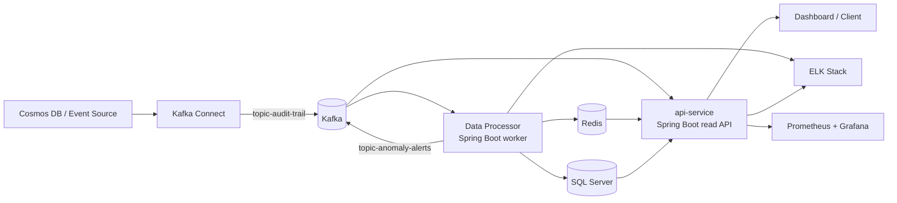

# PFE

An event-driven analytics platform for turning raw insured-user audit trails into anomaly detection, risk scoring, next-action prediction, and dashboard-ready operational insights.

This repository is not a single application. It is a small platform made of:

- a processing engine that consumes audit events and produces analytics
- a read-only API that exposes those analytics to a dashboard
- infrastructure for Kafka, Redis, Kafka Connect, monitoring, logging, and DevOps tooling
- datasets, simulators, notebooks, and helper scripts used to test and evolve the pipeline

## What This Repository Is

At a high level, this project observes user activity events, reconstructs sessions, detects suspicious behavior, stores analytical results, and makes them available to a dashboard in near real time.

The core use case is operational intelligence around insured-user behavior:

- detect abnormal sessions
- classify anomaly types
- estimate user risk
- predict likely next actions
- expose live stats and anomaly streams to a frontend
- support monitoring, logging, and local experimentation

## The Big Picture



## Core Runtime Flow

1. Audit-trail events arrive from a source system, with Kafka Connect prepared to ingest from Cosmos DB into Kafka.
2. `Data Processor` consumes the audit stream from `topic-audit-trail`.
3. It rebuilds user sessions in Redis, updates live counters, applies rule-based anomaly checks, and periodically runs ML inference.
4. When a session closes, it persists session analytics, anomaly events, next-action predictions, daily stats, and user risk profiles into SQL Server.
5. It publishes anomaly alerts back to Kafka on `topic-anomaly-alerts`.
6. `api-service` reads from SQL Server, Redis, and Kafka to serve REST endpoints and SSE streams for a dashboard.
7. Prometheus, Grafana, Logstash, Elasticsearch, and Kibana support observability around the platform.

## Main Components

| Component | Role | Main Tech |
| --- | --- | --- |
| `Data Processor/` | Background analytics worker | Spring Boot, Kafka, Redis, SQL Server, ONNX Runtime, XGBoost |
| `api-service/` | Read-only dashboard API | Spring Boot, JPA, Redis, Kafka, SSE, Gemini |
| `Infra/` | Core local infrastructure | Docker Compose, Kafka, Redis, Kafka Connect |
| `monitoring/` | Metrics stack for local use | Prometheus, Grafana |
| `elk/` | Centralized log ingestion and search | Elasticsearch, Logstash, Kibana |
| `pfe-devops/` | Self-hosted DevOps workspace | GitLab, GitLab Runner |
| `data/` | Raw or reference CSV datasets | Audit-trail CSV files |
| `scripts/` | Dataset generation and simulation tooling | Python, notebooks, JSON flow definitions |

## Repository Map

### `api-service/`

This is the dashboard-facing backend. It does not write the analytics pipeline. It reads the latest analytical state and presents it in frontend-friendly shapes.

What it exposes:

- session-analysis browsing with pagination and filters
- anomaly-event history and details
- current active anomaly for an insured user
- user risk snapshots
- next-action predictions
- live stats and trend stats
- SSE streams for anomalies and live updates
- optional AI-generated anomaly explanations

Useful entry points:

- `src/main/java/com/neo/dashboard/controller/AnalyticsController.java`
- `src/main/java/com/neo/dashboard/service/AnomalyExplanationService.java`
- `src/main/java/com/neo/dashboard/service/StatsService.java`
- `src/main/resources/application.yaml`

Default local port: `8081`

### `Data Processor/`

This is the heart of the analytics pipeline. It is a worker service, not a REST API.

What it does:

- consumes audit events from Kafka
- stores in-progress session state in Redis
- applies tier-1 deterministic anomaly rules
- applies tier-2 ML anomaly scoring with an ONNX autoencoder
- enriches suspicious sessions with anomaly type and next-action predictions
- computes live statistics and user risk profiles
- writes durable analytical tables to SQL Server
- emits anomaly alerts back to Kafka

Useful entry points:

- `src/main/java/com/noveocare/dataprocessor/kafka/AuditTrailConsumer.java`
- `src/main/java/com/noveocare/dataprocessor/service/StatisticsService.java`
- `src/main/java/com/noveocare/dataprocessor/inference/ModelInferenceService.java`
- `src/main/resources/application.yaml`
- `src/main/resources/db/migration/V1__init.sql`
- `scripts/generate_transition_matrix.py`
- `scripts/train_session_scorer.py`

Important durable tables created by the processor:

- `session_analysis`
- `anomaly_events`
- `action_stats_daily`
- `next_action_predictions`
- `user_risk_profile`

### `Infra/`

Infrastructure definitions for the data plane and local dependencies:

- Kafka in KRaft mode
- Redis
- Kafka Connect
- a custom Kafka Connect image that installs the Cosmos DB connector and Elasticsearch sink connector
- a Cosmos DB source connector config that maps events into `topic-audit-trail`

This folder is the main place to understand how the repository expects Kafka and Redis to exist locally.

One practical detail: the main Compose files in `Infra/` and `elk/` are configured to use an external Docker network called `shared-net`, so that network may need to exist before starting the stack.

### `monitoring/`

Local Prometheus and Grafana stack.

The Prometheus config is prepared to scrape Spring Boot metrics from host services. This is the metrics view of the platform.

At the moment, the monitoring setup is clearly ready for `api-service`, and it also contains a target for `Data Processor`, but the worker itself is structured as a non-web process. Treat the monitoring folder as a local observability starting point rather than a fully finalized production setup.

### `elk/`

Centralized logging stack:

- Logstash receives Spring Boot logs over TCP on port `5000`
- Logstash can also receive frontend logs over HTTP on port `5001`
- Elasticsearch stores logs
- Kibana provides search and dashboards

Both Java services already contain Logstash appenders in `logback-spring.xml`.

### `pfe-devops/`

A self-hosted GitLab and GitLab Runner setup intended for CI/CD or team collaboration around this project.

### `data/`

Large CSV datasets used as reference or training input for the anomaly and trend workflow.

### `scripts/`

Standalone Python and notebook assets for:

- real-time Kafka simulation
- yearly dataset generation
- graph-aware session flow modeling
- anomaly injection
- experimentation around realistic user journeys

This folder is best understood as project support tooling, not the production runtime.

## Detection and Analytics Strategy

The project uses a layered approach rather than a single detector.

### Tier 1: Fast rules

The processor checks for patterns such as:

- suspicious hours
- session starts without allowed login actions
- repeated failures
- rapid-fire bursts
- country changes during one session
- long inactivity gaps
- unlikely action transitions

### Tier 2: Sequence anomaly scoring

An ONNX autoencoder scores how unusual a session looks based on features such as:

- action sequence
- device and country encoding
- timing deltas
- sequence position
- session length
- KO rate and related signals

### Tier 3: Enrichment

When a session is suspicious, the pipeline can also:

- classify anomaly type
- predict top next actions
- refresh user risk profile
- publish an enriched alert for downstream consumers

## Data Stores and Their Responsibilities

| Store | Responsibility |
| --- | --- |
| Kafka | event ingestion and anomaly-alert distribution |
| Redis | active session buffers, live counters, risk cache, next-action cache, active anomalies |
| SQL Server | durable analytics history and dashboard query model |
| Elasticsearch | centralized structured logs |

This separation is important: Redis holds fast-changing operational state, while SQL Server holds the durable analytical model that the API queries.

## Local Development Story

The repository is designed around a local setup where infrastructure runs in Docker and the two Spring Boot services run from the host machine.

Typical local assumptions across the repo:

- Kafka on `localhost:9092`
- Redis on `localhost:6379`
- SQL Server on `localhost:1433`
- API service on `localhost:8081`
- Prometheus on `localhost:9090`
- Grafana on `localhost:3000`
- Kibana on `localhost:5601`

### Suggested startup order

1. Start infrastructure from `Infra/`:
   `kafka`, `redis`, and optionally `kafka-connect`
2. Start observability if needed:
   `monitoring/` and `elk/`
3. Start `Data Processor/`
4. Start `api-service/`
5. Feed events through Cosmos DB, Kafka Connect, or the local Python simulators

### Run the Java services

From `Data Processor/`:

```powershell
.\mvnw.cmd spring-boot:run
```

From `api-service/`:

```powershell
.\mvnw.cmd spring-boot:run
```

### Build and test

From each Java module:

```powershell
.\mvnw.cmd compile
.\mvnw.cmd test
```

## First-Time Reader Guide

If you are new to the repo, read in this order:

1. `Data Processor/README.md`
2. `api-service/README.md`
3. `Infra/docker-compose.yml`
4. `Data Processor/src/main/resources/application.yaml`
5. `api-service/src/main/resources/application.yaml`
6. `Data Processor/src/main/java/com/noveocare/dataprocessor/kafka/AuditTrailConsumer.java`
7. `api-service/src/main/java/com/neo/dashboard/controller/AnalyticsController.java`

That path gives you the business intent first, then the concrete runtime wiring.

## Folder-by-Folder Purpose

| Folder | Why it exists |
| --- | --- |
| `api-service` | Exposes the analytical read model to dashboards and clients |
| `Data Processor` | Builds the analytical read model from raw audit events |
| `Infra` | Boots Kafka, Redis, Kafka Connect, and related local infra |
| `monitoring` | Provides Prometheus and Grafana for metrics |
| `elk` | Provides centralized log ingestion and search |
| `pfe-devops` | Provides GitLab and Runner for DevOps workflows |
| `data` | Stores raw/reference CSV datasets |
| `scripts` | Holds simulation, notebooks, and dataset-generation helpers |

## What Makes This Repo Interesting

- It combines classic backend engineering with ML-backed anomaly detection.
- It uses an event-driven architecture instead of synchronous request-first processing.
- It separates write-side analytics generation from read-side dashboard delivery.
- It includes not only apps, but also the surrounding operational stack: infra, logging, metrics, and DevOps.
- It keeps simulation and experimentation assets close to the runtime code, which makes the project easier to demo and evolve.

## Important Notes

> This repository appears to be configured primarily for local or prototype use. Review `application.yaml`, Docker Compose files, and connector configs before using it in any real environment.

Things a newcomer should know immediately:

- `api-service` is read-only.
- `Data Processor` is the write-side analytics engine.
- There is no frontend application in this repository; the dashboard is an external consumer of `api-service`.
- Redis is used for operational speed, SQL Server for durable analytics.
- Some config files contain hardcoded local values and should be externalized for production.

## In One Sentence

This repo is a full prototype platform for ingesting insured-user activity logs, detecting anomalies, generating analytics and predictions, and exposing the results through a dashboard-ready API with monitoring and DevOps support included.
