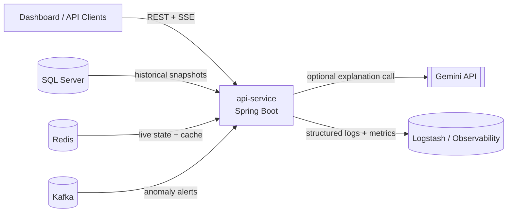

# API Service

> Read-only analytics and anomaly-intelligence backend for the dashboard.

This project is a Spring Boot service that exposes historical analytics, live anomaly signals, risk snapshots, next-action predictions, and AI-assisted anomaly explanations.

It sits between the dashboard and the analytics data plane:

- SQL Server provides durable analytics snapshots and historical records
- Redis provides low-latency live state and cached responses
- Kafka feeds live anomaly alerts
- Gemini can generate short operational explanations for anomaly events

## What This Service Does

The API is designed for dashboard-style consumption. It does not own the write pipeline; instead, it reads from precomputed tables, cache entries, and live topics, then reshapes that data into frontend-friendly responses.

Main capabilities:

- Browse analyzed sessions with filters and pagination
- Browse anomaly events and inspect individual event payloads
- Get the latest risk profile for an insured user
- Get predicted next actions for an insured user
- Serve live and trend statistics
- Stream anomaly alerts and live stats with Server-Sent Events
- Generate anomaly explanations with Gemini or a local fallback strategy

## Architecture



## Core Design

### Read-first architecture

This service is intentionally read-oriented:

- historical and paginated data comes from SQL Server
- current, fast-changing state comes from Redis
- live events come from Kafka
- explanations are generated on demand and cached in Redis

### Consistent API envelope

List and detail endpoints return a shared response shape:

```json
{
  "data": {},
  "meta": {}
}
```

For non-paginated endpoints, `meta` is `null`.

### Graceful fallbacks

Several features are built with fallback logic:

- risk profiles: Redis first, SQL fallback
- next-action predictions: Redis first, SQL fallback
- active anomaly: Redis first, latest persisted anomaly fallback
- stats: Redis first, SQL or empty payload fallback depending on endpoint
- anomaly explanations: cached value first, Gemini second, local heuristic fallback last

## API Surface

Base path: `http://localhost:8081/api/analytics`

| Method | Endpoint | Purpose |
| --- | --- | --- |
| `GET` | `/sessions` | Paginated session analysis with filters |
| `GET` | `/sessions/{id}` | Session analysis detail |
| `GET` | `/anomaly-events` | Paginated anomaly event list |
| `GET` | `/anomaly-events/{id}` | Anomaly event detail |
| `GET` | `/anomaly-events/{id}/explanation` | Generated explanation for one anomaly event |
| `GET` | `/risk/{insuredId}` | Latest insured risk profile |
| `GET` | `/next-actions/{insuredId}` | Predicted next actions |
| `GET` | `/stats/live` | Current live stats snapshot |
| `GET` | `/stats/trend` | Trend stats snapshot |
| `GET` | `/anomaly/active/{insuredId}` | Current active anomaly, if any |
| `GET` | `/stream/anomalies` | SSE anomaly alert stream |
| `GET` | `/stream/live` | SSE live stats stream |

### Example queries

```http
GET /api/analytics/sessions?page=0&size=20&insuredId=12345
GET /api/analytics/anomaly-events?tier=HIGH&type=BEHAVIOR_SHIFT
GET /api/analytics/stats/live?date=2026-04-03
GET /api/analytics/anomaly-events/42/explanation?refresh=true
```

## Data Model at a Glance

The service reads from these main tables:

- `session_analysis`
- `anomaly_events`
- `user_risk_profile`
- `next_action_predictions`
- `action_stats_daily`

These are mapped as read-only JPA entities and then transformed into DTOs for the API layer.

## Project Structure

```text
api-service/
|- pom.xml
|- README.md
|- HELP.md
|- src/
|  |- main/
|  |  |- java/com/neo/dashboard/
|  |  |  |- controller/      # HTTP endpoints
|  |  |  |- dto/             # API payloads and response wrappers
|  |  |  |- entity/          # Read-only JPA mappings
|  |  |  |- repository/      # SQL access layer
|  |  |  |- service/         # Business orchestration, caching, streaming, AI
|  |  |  `- ApiServiceApplication.java
|  |  `- resources/
|  |     |- application.yaml
|  |     `- logback-spring.xml
|  `- test/
|     `- java/com/neo/dashboard/
|        |- ApiServiceApplicationTests.java
|        `- service/
|           `- SessionAnalysisServiceTest.java
`- target/                   # Build output
```

## Code Walkthrough for Newcomers

If you are opening this repository for the first time, these are the best entry points:

- `src/main/java/com/neo/dashboard/controller/AnalyticsController.java`
  Route map for the entire public API
- `src/main/java/com/neo/dashboard/service/AnomalyExplanationService.java`
  Best place to understand context aggregation, caching, Gemini integration, and fallback logic
- `src/main/java/com/neo/dashboard/service/StatsService.java`
  Good example of Redis-first and SQL-fallback behavior
- `src/main/java/com/neo/dashboard/service/AnomalyAlertStreamService.java`
  Shows how Kafka events are bridged into SSE

## Tech Stack

| Layer | Technology |
| --- | --- |
| Language | Java 25 |
| Framework | Spring Boot 4 |
| Web | Spring MVC |
| Persistence | Spring Data JPA |
| Database | SQL Server |
| Cache / live state | Redis |
| Messaging | Kafka |
| Metrics | Spring Boot Actuator + Prometheus |
| Logging | Logback + Logstash encoder |
| AI explanation | Gemini via REST |
| Boilerplate reduction | Lombok |
| DTO mapping | MapStruct + generic mapper contract |

## Local Development

### Prerequisites

Before running the service locally, make sure you have:

- Java 25
- Maven wrapper support (`mvnw` / `mvnw.cmd` is included)
- SQL Server with the analytics tables available
- Kafka running on `localhost:9092`
- Redis available on `localhost:6379`

### Redis in Docker

You mentioned Redis is running in Docker, which fits this project well.

If your Redis container already exposes port `6379` to the host, the default configuration in `application.yaml` should work without any change.

Example Redis container:

```bash
docker run -d --name api-service-redis -p 6379:6379 redis:7-alpine
```

Useful checks:

```bash
docker ps
docker logs api-service-redis
```

If your container uses a different host port or network setup, update:

- `spring.data.redis.host`
- `spring.data.redis.port`

### Run the application

Linux/macOS:

```bash
./mvnw spring-boot:run
```

Windows PowerShell:

```powershell
.\mvnw.cmd spring-boot:run
```

The API starts on:

```text
http://localhost:8081
```

### Compile and test

Compile only:

```bash
./mvnw -DskipTests compile
```

Run tests:

```bash
./mvnw test
```

Windows PowerShell equivalents:

```powershell
.\mvnw.cmd -DskipTests compile
.\mvnw.cmd test
```

### Build Docker image with Jib

Windows PowerShell:

```powershell
.\mvnw.cmd jib:dockerBuild
```

This builds an OCI image named:

```text
api-service:0.0.1-SNAPSHOT
```

## Testing Strategy

- unit tests cover mapper behavior with `Instancio` test data generation
- integration tests use `Testcontainers` (Redis path example), with automatic skip when Docker is unavailable

## Liquibase Baseline

Liquibase is included and configured with:

- `spring.liquibase.enabled: false`
- changelog file at `src/main/resources/db/changelog/db.changelog-master.yaml`

This keeps migrations ready for future ownership without changing current read-only runtime behavior.

## Optional Vault in Docker

If you want Vault as a local dependency, run:

```bash
docker run -d --name api-service-vault -p 8200:8200 -e VAULT_DEV_ROOT_TOKEN_ID=root -e VAULT_DEV_LISTEN_ADDRESS=0.0.0.0:8200 hashicorp/vault:1.17 server -dev
```

## Configuration Notes

The default configuration expects:

- SQL Server on `localhost:1433`
- Redis on `localhost:6379`
- Kafka on `localhost:9092`
- API port `8081`
- Prometheus endpoint enabled

Important properties you will likely override per environment:

- `SPRING_DATASOURCE_URL`
- `SPRING_DATASOURCE_USERNAME`
- `SPRING_DATASOURCE_PASSWORD`
- `SPRING_DATA_REDIS_HOST`
- `SPRING_DATA_REDIS_PORT`
- `SPRING_KAFKA_BOOTSTRAP_SERVERS`
- `GEMINI_API_KEY`

### Environment-first configuration (GitHub-safe)

Sensitive values and deploy-specific URLs are read from environment variables.

- Do not commit real values in source control.
- Use `.env.example` as the template.
- Keep your real values in `.env` (already gitignored).

## Observability

The service already includes a useful baseline for operations:

- actuator endpoints are exposed
- Prometheus metrics are enabled
- logs go to console and to a Logstash TCP appender

Important URLs:

- `http://localhost:8081/actuator`
- `http://localhost:8081/actuator/prometheus`

## Runtime Behavior Worth Knowing

- CORS is currently open to all origins in the controller
- anomaly explanation generation is optional and degrades gracefully if Gemini is unavailable
- SSE is used for live updates instead of WebSockets
- DTOs and entities are intentionally separated to keep API contracts decoupled from table layout

## Suggested Next Improvements

If this repository continues to grow, these are strong next steps:

- add a dedicated `README` section with example JSON responses
- externalize all secrets and remove any default sensitive values from config
- add integration tests for Redis, Kafka, and explanation generation
- add containerized local dev with Docker Compose for SQL Server, Redis, and Kafka
- add OpenAPI / Swagger documentation for consumers

## Summary

`api-service` is the dashboard-facing read API for analytics and anomaly monitoring. It combines precomputed SQL data, low-latency Redis state, Kafka-driven live events, and optional AI explanations into one consistent Spring Boot service that is straightforward to extend and easy to consume from a frontend.
